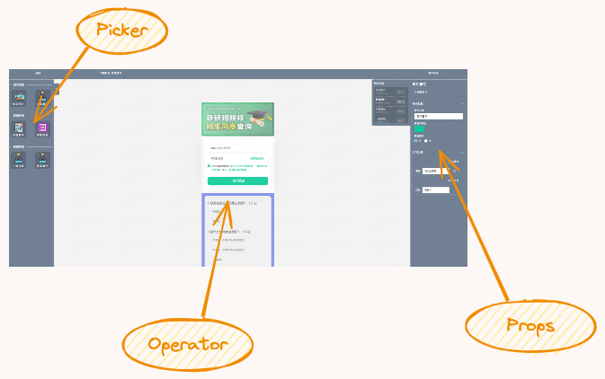

# 零码工具

## 原理介绍

利用`umi`为主开发框架，内置`dva`状态管理等其他工具。结合`webpack5`提供的模块联邦`ModuleFederationPlugin`功能，将编辑区与组件库相分离，编辑区充当消费者，组件库充当生产者。利用`React-Dnd`与`React-grid-layout`等拖拽工具库处理页面布局与核心拖拽交互逻辑。

## 整体结构



整体工具分为三大部分：
其中中间为编辑区、左侧为组件部分、右侧为组件相关属性配置区。

### 组件菜单区（Picker）

```jsx
import CompLoaderEngine from 'lowcodeUI/loader';
import { useDrag } from 'react-dnd';

export default DragCompOption = (props) => {
    const { 
        terminalType, // 用于区分是移动端还是 pc 端。1 为移动端，2 为 pc 端。
        keys, 
        ...resetProps 
    } = props;

    // dragger 为被拖拽元素
    const [, dragger] = useDrag({
        type: 'Component',
        item: {
            ...resetProps,
        },
    });

    return (
        <div 
            className={cx('drag')} 
            ref={dragger}
        >
            <div className={cx('drag__img')}>
                <CompLoaderEngine
                    componentPathUrl={resetProps.componentUrl}
                    id={resetProps.componentUrl}
                    thumb={true}
                />
            </div>
        </div>
    );
};
```

上述组件为一个独立的可被用于拖拽的组件，其中的核心部分为`CompLoaderEngine`组件，该组件通过`umi`中的`dynamic`方法动态导入指定路径下的某个组件，并通过`thumb`属性区分是引入图标组件还是真实组件。

核心代码如下：

```jsx
/***
 * 组件动态加载引擎 DynamicEngine
 */
import { dynamic } from 'umi';

export default CompLoaderEngine = ({
    componentPathUrl,
    ...other
}) => {
    return dynamic({
        loader: async () => {
            const { default: Component } = await import(`@/components/${componentPathUrl}/instance`);

            return (_props) => {
                return (
                    <Component {..._props} />
                );
            };
        }
    });
};
```

整个菜单区只需通过模块联邦导入并遍历远程组件库完成渲染。

核心代码如下：

```jsx
import lowcodeComponents from 'lowcodeUI/components';

export default Picker = (props) => {
    return (
        <>
            {
                lowcodeComponents.map((item, idx) => (
                    <DragCompOption        
                        {...props} 
                        key={idx} 
                    />
                ))
            }
        </>
    )
}
```

### 编辑区（Operator）

编辑区的核心为`UIEditorRender`组件，其本质是一个利用`GridLayout`包裹的可上下拖动改变其中组件位置的容器。因该处编辑区为整个工具交互的核心，所以会涉及到很多计算。例如组件的顺序改变，以及改变之后的位置计算（主要是RGL的y坐标计算）。还有定位与高亮当前正在操作的组件等等。因此必须提供相应的属性。

核心代码如下：

```jsx
import UIEditorRender from 'lowcodeUI/editor';
import { uuid } from 'utils';

export default Operator = ({
    componentsData, // 标识当前编辑区已有的组件
    updateComponentsData, // 更新组件列表的方法
    updateCurrentCompEffect // 更新组件携带的位置等属性的方法
    ...other
}) => {
    const [, droper] = useDrop({
        accept: 'Component',
        drop: (item, monitor) => {
            /** 获取当前拖拽点的位置（pointEnd），这是一个监控拖拽事件并返回拖拽点相对于客户端（浏览器视窗）的位置信息的函数。 */
            const pointEnd = monitor.getSourceClientOffset();
            /** ...计算父组件也即舞台顶部的top值 */
            /**
             * 变量y计算了拖拽点相对于舞台顶部的垂直位置，如果拖拽点位于舞台顶部之上，则y为0，否则为拖拽点的y坐标减去舞台顶部的y坐标。
             */
            const gridY = pointEnd.y < top ? 0 : pointEnd.y - top;

            const gridlayout = {
                i: `x-${uuid()}`, // 通过
                x: 0,
                y: gridY,
                w: LAYOUT_STYLE.COLS,
                h: item.gridlayout.h,
                isBounded: true,
            };

            /** 更新打当前组件属性 */
            const currentComponent = {
                ...item,
                gridlayout
            };

            updateCurrentCompEffect(currentComponent);
        }
    });

    // 处理用户拖拽结束后的组件顺序
    const dragStop = (layout, oldItem, newItem) => {
        /** ...省略拖拽结束之后的组件顺序排布处理 */
    
        // 重新排序
        const newComponentsData = newComponentsData.sort((a, b) => {
            return a.gridlayout.y - b.gridlayout.y;
        });

        updateComponentsData(newComponentsData);
    }

    return (
        <div>
            <UIEditorRender 
                componentsData={componentsData}
                updateComponentsData={updateComponentsData}
                updateCurrentCompEffect={updateCurrentCompEffect}
                dragStop={dragStop}
                {...other}
            />
        </div>
    )
}
```

```jsx
import CompLoaderEngine from './render.engine';
import GridLayout from 'react-grid-layout';

export default EditorRenderUI = ({
    componentsData,
    updateComponentsData,
    updateCurrentCompEffect,
    dragStop
}) => {
    const layouts = componentsData.map((item) => ({
        ...item.gridlayout
    }));

    // 识别当前正在拖拽的组件
    const onDragStart = (layout, oldItem, newItem) => {
        if (!newItem.moved) {
            const currentComponent = componentsData.find((item) => {
                return item.id === newItem.i.split('-')[1];
            });
            updateCurrentCompEffect({ ...currentComponent });
        }
    };

    return (
        <GridLayout
            className='layout'
            layout={layouts}
            isResizeable={false}
            onDragStart={onDragStart}
            onDragStop={dragStop}
        >
            {
                componentsData.map((item) => (
                    <CompLoaderEngine
                        id={item.id}
                        config={item.config}
                        componentPathUrl={item.componentUrl}
                    />
                ))
            }
        </GridLayout>
    )
}
```

### 属性配置区（props）

编辑区中的任何组件被点击激活后，右侧同时弹出对应的属性配置，主要用到的是组件中的`schema`属性。

核心代码如下：

```jsx
import { Form } from 'antd';
import ColorPicker from '../components/editor.form/editor.form.color';

export default Props = ({
    currentComponent,
    updateCurrentComponentEffect,
    terminalType
}) => {
    const ratio = terminalType / 2;

    const [form] = Form.useForm();

    const onFinish = (values) => {
        if (values.config) {
            const currentComponent = { ...values };
            updateCurrentComponentEffect(currentComponent);
        }
    };

    const onValuesChange = (changeValue) => {
        currentComponent.config = form.getFieldsValue();
        // 如果组件属性中包含背景图片的配置，需要在上传图片之后计算新的组件宽高，以便能在编辑区正常展示
        if (changeValue.backgroundImage) {
            const img = new Image();
            img.onload = () => {
                const componentSize = { width: img.width * ratio, height: img.height * ratio };
                currentComponent.config.componentSize = componentSize;
                currentComponent.gridlayout.h = img.height * ratio;
            }
        }
        onFinish(currentComponent);
    };

    return (
        <Form
            form={form}
            initialValues={currentComponent.config}
            onValuesChange={onValuesChange}
            onFinish={onFinish}
        >
            {
                currentComponent.schema.map((item, idx) => (
                    <>
                        {
                            item.forms.map((schema) => (
                                {
                                    schema.type === 'UICOLOR' && (
                                        <Form.Item
                                            name={schema.key}
                                        >
                                            <ColorPicker />
                                        </Form.Item>
                                    )
                                    {/* ...同上的方式，枚举其他类型并匹配相应的组件 */}
                                }
                            ))
                        }
                    </>
                ))
            }
        </Form>
    )
}
```

## 其他

### 组件

这部分介绍下可被用于拖拽到编辑区的组件是如何将上述内容中涉及到的`props`和`schema`等属性结合到一起的。

首先定义一个用于导出组件的文件`export.js`：

```jsx
const componentsList = [
    // ...只列举了双端的图片组件用于说明
    'image.normal.wap',
    'image.normal.pc',
];

/**
 * @description 该方法是按照组件的路径将相应的 props 属性导入到一块儿形成一个对象返回
 */
const getComponentPropsByKey = (componentUrl) => {
    const componentProps = require(`../components/${componentUrl}/props`).default;
    const { schema, terminalType } = componentProps;
    const { config } = schema;
    return { componentProps, schema, terminalType, config, componentUrl };
}

export default components = componentsList.map((componentUrl) => {
    const { componentProps } = getComponentPropsByKey(componentUrl);
    return {
        ...componentProps,
        componentUrl
    };
})
```

接下来看如何应用上述`export.js`文件，回顾`Picker`组件头部导入语句：

```jsx
import lowcodeComponents from 'lowcodeUI/components';
```

其中的`lowcodeUI`其实是模块联邦统一定义的 name。意味着上述`lowcodeComponents`是从模块联邦的生产者中导入的。它与`export.js`是如何结合起来的？这需要另外一个配置属性`exposes`：

```js
exposes: {
    './components': path.resolve(
        __dirname,
        '../src/core/comp/export.js',
    ),
}
```

接下来介绍模块联邦相关配置。

### 模块联邦（ModuleFederationPlugin）

