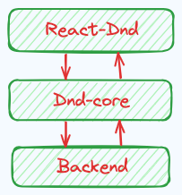

# React-Dnd

`React-Dnd`，一个适用于 React 的拖拽库。介绍它之前先回顾下 H5 中的拖拽 api ，因为本质上`React-Dnd`也是基于此实现的。

## drag & drop

关于被拖拽元素，需要设置属性`draggable`为 true。与之相关的事件有：

+ `dragstart`: 开始拖拽时触发
+ `drag`: 拖拽过程中触发
+ `dragend`: 拖拽结束触发，在`drop`事件之后触发

***

关于拖拽目标元素，与之相关的事件有：

+ `dragenter`: 拖拽元素进入拖拽目标元素时触发
+ `dragover`: 拖拽元素在拖拽目标元素上移动时触发，间隔在几百毫秒
+ `dragleave`: 拖拽元素从拖拽目标元素上离开后触发
+ `drop`: 拖拽元素被放置到拖拽目标元素上时触发

***

> 因浏览器默认行为不允许放置元素，因此保证`drop`事件生效的条件是阻止`dragover`事件的默认行为

## 原理解析

`React-Dnd`整个工具库总体包含三大块核心：



其中`React-Dnd`负责向下层提供api，内部通过`Dnd-core`处理拖拽逻辑，并通过`Backend`适配不同环境下的交互方式。

+ `React-Dnd`: 封装了`DragDropContext`、`Draggable`、`Droppable`等组件，提供了`useDrag`、`useDrop`等 hooks api。
+ `Dnd-core`: 提供了拖拽功能的核心逻辑与 api，并且不依赖于任何 UI 框架。主要负责处理拖放操作的的注册，拖动源和放置目标的管理，事件的分发等功能。
+ `Backend`: 处理具体的拖拽交互细节，不同的 backend 可支持不同的运行环境，例如 pc 端的拖拽事件、移动端的触摸事件等。

`React-Dnd`起始于一个通过`React.createContext`创建的高阶组件`DndProvider`。主要作用是包裹拖拽组件，控制拖拽行为，向下传递数据等。

```html
<DndProvider backend={HTML5Backend}>
    <Components {...props} />
</DndProvider>
```

使用过程中为`DndProvider`传递了一个`backend`属性，其值为`HTML5Backend`，它来自于`react-dnd-html5-backend`模块，意味着处理的是拖拽事件。

接下来分别详细介绍各个模块：

### React-Dnd

常用API：

+ `useDrag`

该钩子函数接收两个参数：`specArg`与`deps`，前者为一个对象或者返回对象的函数，定义了拖动源的行为和状态。后者为依赖数组，用于性能优化。

钩子内部采用了`useOptionalFactory`（其实就是一个`useMemo`）处理`specArg`，根据`deps`决定是否需要重新计算`specArg`。

接着创建了拖动源监视器`monitor`和连接器`connector`，分别通过`useDragSourceMonitor`与`useDragSourceConnector`钩子实现。其中监视器用于追踪拖动源的状态，而连接器则用于将拖动源连接到 DOM 元素上。

`useRegisteredDragSource`钩子用于注册拖动源，它将拖动规范、监视器和连接器结合起来，确保拖动源能够正确地与`React-Dnd`的`backend`进行交互。

最终`useDrag`返回一个数组，包含三个元素：收集到的属性、拖动源元素、拖动预览元素。这三个返回值通过连接 DOM 元素与配置拖动行为，允许开发者轻松实现拖拽功能。

核心源码如下：

```jsx
/**
 * useDragSource hook
 * @param sourceSpec The drag source specification (object or function, function preferred)
 * @param deps The memoization deps array to use when evaluating spec changes
 */
export function useDrag<
    DragObject = unknown,
    DropResult = unknown,
    CollectedProps = unknown,
>(
    specArg: FactoryOrInstance<
        DragSourceHookSpec<DragObject, DropResult, CollectedProps>
    >,
    deps?: unknown[],
): [CollectedProps, ConnectDragSource, ConnectDragPreview] {
    const spec = useOptionalFactory(specArg, deps)
    /** ... */
    const monitor = useDragSourceMonitor<DragObject, DropResult>()
    const connector = useDragSourceConnector(spec.options, spec.previewOptions)
    useRegisteredDragSource(spec, monitor, connector)

    return [
        useCollectedProps(spec.collect, monitor, connector),
        useConnectDragSource(connector),
        useConnectDragPreview(connector),
    ]
}
```

用法如下：

```jsx
const [collected, dragRef, previewRef] = useDrag({
    type: 'TYPE', // 定义与标识拖拽源，用于在 useDrop 中用同样的 type 进行匹配。
    item: {}, // 用于从拖拽源到放置源传递必要的信息，也可以用于标识拖拽源，例如： { id : 1}
    options: {
        dropEffect: 'move' | 'copy' // 标识放置过程为移动还是复制
    },
    previewOptions: {
        captureDraggingState: true | false, // 用于控制组件是否在拖拽开始时立即知道自己正在被拖拽
        anchorX: 0, // 表示拖拽预览相对于拖拽源的定位方式，范围为 0 - 1，默认为 0.5，0 表示预览对齐左边或顶部，1 表示对齐到右边或者底部，下同
        anchorY: 0, 
        offsetX: 0, // 标识的是光标与拖拽预览之间的垂直偏移量，该值设置后会使 anchor 定位失效
        offsetY: 0
    },
    // 拖拽停止时触发，item 为拖拽源携带的信息
    end: (item, monitor) => {
        monitor.didDrop(); // 返回 boolearn 类型，表示是否已放置拖拽源
        monitor.getDropResult(); // 可获取放置区 drop 方法的返回内容
    },
    canDrag: true | false | (monitor => true | false),
    isDragging: monitor => true | false, 
    collect: monitor => {}, // 返回的内容可被第一个参数 collected 搜集
})
```

+ `useDrop`

原理与用法基本类似`useDrag`，只是少了拖拽预览一项，只不过监视器`monitor`跟连接器`connector`是通过`useDropTargetMonitor`和`useDropTargetConnector`创建的。

用法如下：

```jsx
const [collected, dropRef] = useDrop({
    accept: 'TYPE', // 接收相同 type 的 drag 拖拽源
    item: {}, // 接收拖拽源传递的信息
    options: {
        dropEffect: 'move' | 'copy' // 标识放置过程为移动还是复制
    },
    // 拖拽源放置时触发，item 为接收到的拖拽源的信息
    drop: (item, monitor) => {
        monitor.didDrop(); // 返回 boolearn 类型，表示是否已放置拖拽源
        monitor.getDropResult(); // 可获取放置区 drop 方法的返回内容
    },
    // 拖拽源悬浮于 drop 区时触发
    hover: (item, monitor) => {
        monitor.isOver({ shallow: true }) // 用于检测悬停是仅发生在当前目标还是包括了嵌套目标
    },
    canDrop: true | false | (monitor => true | false),
    collect: monitor => {}, // 返回的内容可被第一个参数 collected 搜集
})
```